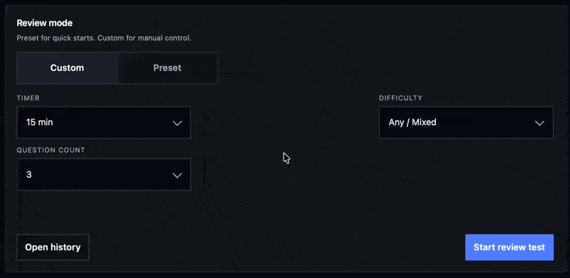
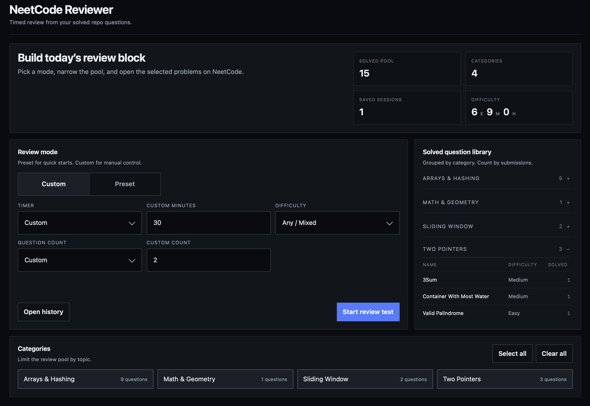
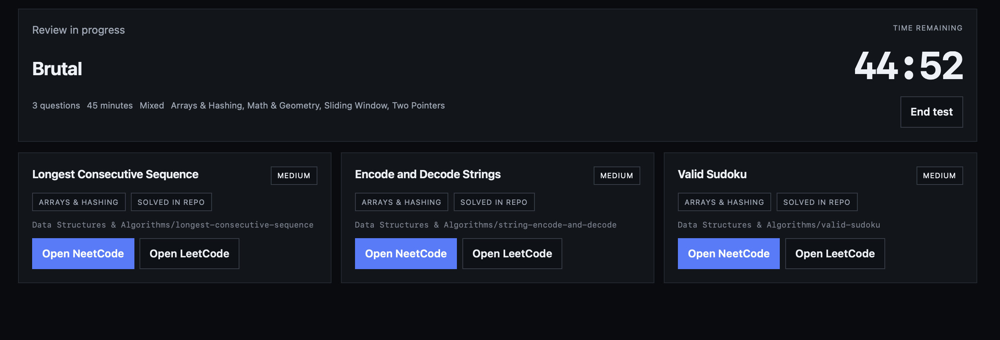
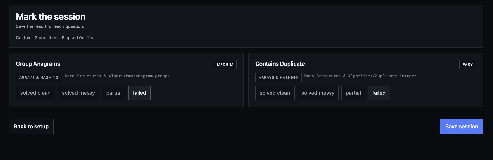

Yes I willingly did this 🫩

This repo keeps record of all my Neetcode submissions. Then I vibe-coded a reviewer using my solved-question pool.

Keeping the repo clean by storing my progress only.

  
    
  
    
  
    
  

