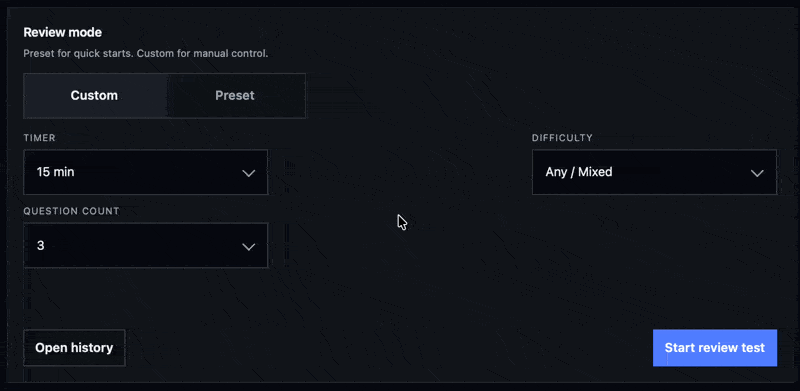
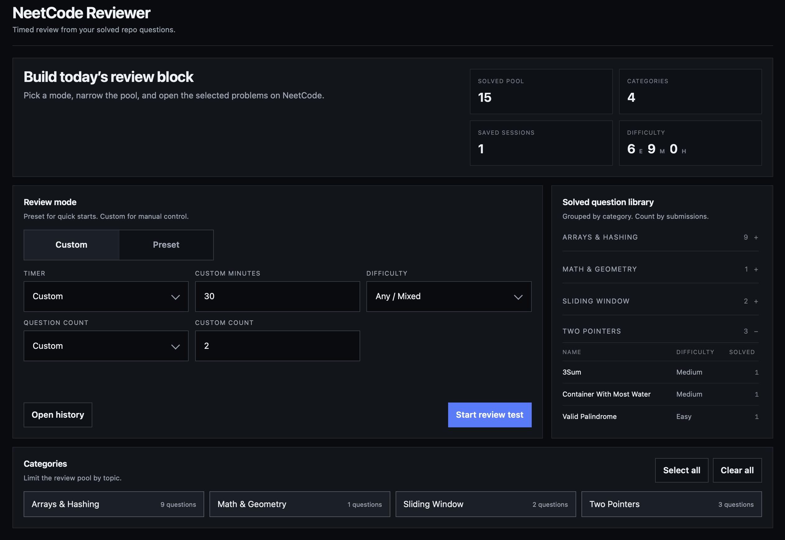
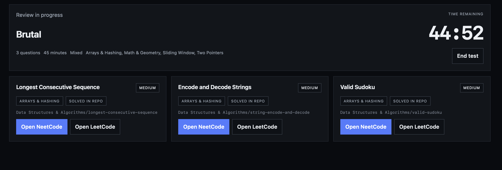
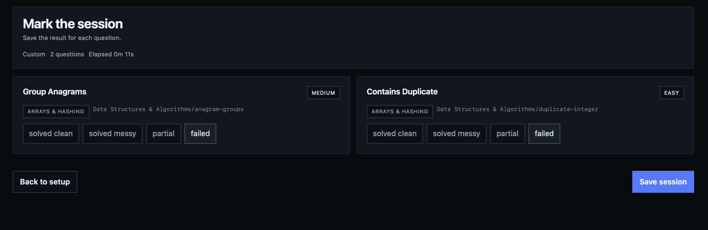

# NeetCode archive

Yes I willingly did this 🫩

My submitted NeetCode solutions, plus a local review experiment built around the solved-question pool.
The tracked repository keeps the submission history and these reviewer captures.

  
    
  
    
  
    
  

